# AI Audio To Text Converter 🎙️


**AI Audio To Text Converter** is a powerful web tool that instantly converts any audio file into accurate text using Google's Gemini AI. It runs directly in your browser, making it fast, free, and easy to use.

---

## 🌟 What It Does

*   **🎵 Converts Audio to Text**: Supports MP3, WAV, M4A, OGG, and MP4 files.
*   **🌍 Multi-Language**: Automatically detects and translates languages like English, Hindi, Spanish, French, etc.
*   **🗣️ Speaker Detection**: Identifies who is speaking (e.g., "Speaker 1" vs "Speaker 2").
*   **📊 Sentiment Analysis**: Detects the tone of the conversation (Positive, Neutral, Negative).
*   **⚡ Instant Result**: No waiting for file uploads to a server. Processing happens immediately via the API.

---

## 🚀 How It Works

This tool connects your browser directly to Google's AI engine.

```mermaid
sequenceDiagram
    participant User
    participant Browser
    participant GoogleGeminiAI

    User->>Browser: 1. Drag & Drop Audio File
    Browser->>GoogleGeminiAI: 2. Send Audio Data
    Note right of GoogleGeminiAI: 🧠 AI Transcribes & Analyzes
    GoogleGeminiAI-->>Browser: 3. Return Text Transcript
    Browser->>User: 4. Display Result
```



---

## 📦 Quick Start

1.  **Clone the repository**:
    ```bash
    git clone https://github.com/souravkr529/AI-Audio-To-Text-Converter.git
    ```
2.  **Open the App**:
    Double-click `voice.html` to open it in Chrome/Edge/Firefox.

3.  **Add API Key**:
    *   Edit `voice.html`.
    *   Replace `const API_KEY = "..."` with your Google Gemini API Key.
    *   Save and refresh.

4.  **Use It**:
    Drag and drop your recording to see the magic!

---

## 🛡️ Security Note

This app runs client-side for privacy. Your audio files are not stored on our servers. The API Key is stored in the file itself, so use this tool locally or in a private environment.

## 🛠️ Tech Stack

*   **AI Model**: Google Gemini 2.0 Flash
*   **Frontend**: HTML5, JavaScript
*   **Style**: TailwindCSS

## 📄 License

MIT License. Free to use for personal or commercial projects.
