```mermaid
graph LR
    User((👤 You))
    
    subgraph Browser_Safe_Zone ["🔒 Secure Browser Environment"]
        Browser[("💻 Web App")]
        KeyStore[["🔑 LocalStorage"]]
    end

    subgraph Providers ["☁️ AI Cloud Providers"]
        Gemini[/"🧠 Google Gemini"\]
        OpenAI[/"🟢 OpenAI GPT-4o"\]
    end

    User -->|"1. Input Key"| Browser
    Browser -.->|"Save Key"| KeyStore
    User -->|"2. Upload Audio"| Browser
    Browser ==>|"3. Routing (Toggle)"| Providers
    Providers ==>|"4. Return JSON"| Browser
    Browser -->|"5. Render Chat/Doc"| User
```

# 🎙️ DuoAI: Audio To Text Converter
### The Secure, Private, and Free Web-Based Transcriber

**DuoAI Audio To Text** is a next-generation transcription tool designed for **absolute privacy** and **flexibility**. Unlike other services that upload your audio to a third-party server, this tool runs entirely in your browser. It connects **directly** to **Google Gemini** or **OpenAI** using your own API keys, ensuring your data never touches a middleman.

---

## 🔒 Security Architecture: How Your Key & Data Are Safe

We utilize a **Bring Your Own Key (BYOK)** architecture. This is the gold standard for privacy-conscious AI tools.

### 🛡️ The "Zero-Server" Guarantee
*   **No Database**: We have no database to store your audio or your keys.
*   **No Backend**: There is no "server" sitting between you and the AI Provider.
*   **Client-Side Storage**: Your API Keys (Gemini or OpenAI) are saved strictly in your browser's `localStorage`. They persist on **your device only**.
*   **Direct Tunnel**: When you transcribe, the request goes from `Your User Device` ➔ `Google/OpenAI Servers`. It cannot be intercepted by us.

### 🔐 Input Hardening
We have implemented military-grade input validation:
*   **Magic Bytes Detection**: Prevents malware from disguising itself as audio files.
*   **Regex Validation**: Ensures only valid API Key formats (Google `AIza...` / OpenAI `sk-...`) are accepted.
*   **XSS Sanitization**: All inputs and outputs are sanitized to prevent script injection attacks.

---

## 🌊 Workflow Diagram

Here is how your data flows securely through the system:

---

## 🌟 Key Features

*   **🤖 Dual AI Power**: Switch instantly between **Google Gemini 2.0** and **OpenAI GPT-4o** with a single click.
*   **💬 Smart UI**:
    *   **Single Speaker**: Shows a clean, professional document layout.
    *   **Multi-Speaker**: Automatically renders a **WhatsApp-style Chat Interface** with distinct colors for each speaker.
*   **⚡ Blazing Fast**: Zero-latency processing directly from your browser.
*   **🌍 Multilingual**: Auto-detects and transcribes English, Hindi, Spanish, French, and 100+ others.
*   **📱 Mobile Optimized**: A responsive UI that works perfectly on iOS, Android, and Desktop.
*   **💸 Cost Efficient**: Use your own API keys (free tier for Gemini, pay-per-use for OpenAI).

---

## 🚀 Quick Start Guide

### Step 1: Get Your API Key
*   **Google Gemini**: [Get Free Key](https://aistudio.google.com/app/apikey)
*   **OpenAI**: [Get Key](https://platform.openai.com/api-keys)

### Step 2: Use the Converter
1.  Open the [Live Tool](https://souravkr529.github.io/AI-Audio-To-Text-Converter/).
2.  **Toggle** your preferred manufacturer (Google or OpenAI).
3.  Click **"Enter Key"** and paste your credentials.
4.  **Drag & Drop** your audio file.
5.  Watch the AI convert it to a beautiful chat or document in seconds!

---

## 🛠️ Technical Stack

*   **Frontend**: HTML5, Vanilla JavaScript (ES6+)
*   **Styling**: TailwindCSS (CDN)
*   **AI Engine**: Google Gemini API & OpenAI API (REST)
*   **Security**: Content Security Policy (CSP), Input Sanitization

## 🙋‍♀️ FAQ

**Q: Can you see my API Key?**
A: **No.** Your key is stored in your browser's local cache. If you clear your browser history, the key is gone. We have no access to it.

**Q: Is my audio uploaded to your server?**
A: **No.** We do not have a server. The audio travels directly from your computer to the AI provider and straight back to you.

**Q: What audio formats are supported?**
A: We support `MP3`, `WAV`, `M4A`, `OGG`, and standard `MP4` video files.

**Q: Contact?**
A: security/inquiries: `souravkr529@gmail.com`

---

## 📜 License

This project is licensed under the **MIT License** - feel free to fork, modify, and use it in your own projects.
