<div align="center">

# 🎙️ DuoAI: Audio To Text Converter

### 🔒 Secure • ⚡ Fast • 🧠 Dual AI Power

[](LICENSE)
[](SECURITY.md)
[](https://aistudio.google.com/)
[](https://openai.com/)
[](https://souravkr529.github.io/AI-Audio-To-Text-Converter/)

**A next-generation transcription tool designed for absolute privacy and zero latency.**
<br>
Runs entirely in your browser using **Google Gemini** or **OpenAI** directly.

[Live Demo](https://souravkr529.github.io/AI-Audio-To-Text-Converter/) •
[Features](#-key-features) •
[Installation](#-installation) •
[Security](#-security-architecture) •
[Support](#-support)

---

</div>

## 🎯 What is DuoAI?

**DuoAI Audio To Text** is a web-based tool that converts audio to text securely. Unlike other services that upload your audio to a third-party server, this tool runs entirely in your browser. It connects **directly** to Google's powerful Gemini AI or OpenAI's GPT-4o using your own API key, ensuring your data never touches a middleman.

---

## ✨ Key Features

*   **🤖 Dual AI Power**: Switch instantly between **Google Gemini 2.0** and **OpenAI GPT-4o** with a single toggle.
*   **💬 Smart Chat UI**:
    *   **Single Speaker**: Shows a clean, professional document layout.
    *   **Multi-Speaker**: Automatically renders a **WhatsApp-style Chat Interface** with distinct colors for each speaker.
*   **⚡ Zero Latency**: No backend processing. Your audio goes straight from Browser ➔ AI.
*   **🌍 Multilingual**: Auto-detects and transcribes English, Hindi, Spanish, French, and 100+ others.
*   **🔒 BYOK Security**: "Bring Your Own Key" architecture ensures you control the costs and privacy.
*   **📱 Mobile First**: A responsive UI that works perfectly on iOS, Android, and Desktop.

---

## 🔒 Security Architecture

We utilize a **Bring Your Own Key (BYOK)** architecture. This is the gold standard for privacy-conscious AI tools.

### 🛡️ The "Zero-Server" Guarantee
*   **No Database**: We have no database to store your audio or your keys.
*   **No Backend**: There is no "server" sitting between you and the AI Provider.
*   **Client-Side Storage**: Your API Keys are saved strictly in your browser's `localStorage`. They persist on **your device only**.

### 🌊 Data Flow Diagram

```mermaid
graph LR
    User((👤 You))
    
    subgraph Browser_Safe_Zone ["🔒 Secure Browser Environment"]
        Browser[("💻 Web App")]
        KeyStore[["🔑 LocalStorage"]]
    end

    subgraph Providers ["☁️ AI Cloud Providers"]
        Gemini[/"🧠 Google Gemini"\]
        OpenAI[/"🟢 OpenAI GPT-4o"\]
    end

    User -->|"1. Input Key"| Browser
    Browser -.->|"Save Key"| KeyStore
    User -->|"2. Upload Audio"| Browser
    Browser ==>|"3. Routing (Toggle)"| Providers
    Providers ==>|"4. Return JSON"| Browser
    Browser -->|"5. Render Chat/Doc"| User
```



---

## 🚀 Quick Start Guide

### Step 1: Get Your API Key
*   **Google Gemini**: [Get Free Key](https://aistudio.google.com/app/apikey)
*   **OpenAI**: [Get Key](https://platform.openai.com/api-keys)

### Step 2: Use the Converter
1.  Open the [Live Tool](https://souravkr529.github.io/AI-Audio-To-Text-Converter/).
2.  **Toggle** your preferred provider (Google or OpenAI).
3.  Click **"Enter Key"** and paste your credentials.
4.  **Drag & Drop** your audio file.
5.  Watch the AI convert it to a beautiful chat or document in seconds!

---

## 📦 Installation (Local Development)

If you want to run this locally:

```bash
# Clone the repository
git clone https://github.com/souravkr529/AI-Audio-To-Text-Converter.git

# Navigate to directory
cd AI-Audio-To-Text-Converter

# Open index.html in your browser
# (No npm install required, it's vanilla JS!)
```

---

## 🛠️ Technical Stack

*   **Frontend**: HTML5, Vanilla JavaScript (ES6+)
*   **Styling**: TailwindCSS (CDN)
*   **AI Engine**: Google Gemini API & OpenAI API (REST)
*   **Security**: Content Security Policy (CSP), Input Sanitization

---

## 🙋‍♀️ FAQ

**Q: Can you see my API Key?**
<br>
A: **No.** Your key is stored in your browser's local cache. If you clear your browser history, the key is gone. We have no access to it.

**Q: Is my audio uploaded to your server?**
<br>
A: **No.** We do not have a server. The audio travels directly from your computer to the AI provider and straight back to you.

---

## 🤝 Contributing

Contributions are welcome! Please feel free to submit a Pull Request.

---

## 📄 License

This project is licensed under the **MIT License** - see the [LICENSE](LICENSE) file for details.

---

## 📞 Support

- 🐛 [Report Bug](https://github.com/souravkr529/AI-Audio-To-Text-Converter/issues)
- 💡 [Request Feature](https://github.com/souravkr529/AI-Audio-To-Text-Converter/issues)
- ⭐ Star this repo if you find it useful!

---

<div align="center">

**Made with ❤️ by [Sourav Kumar](https://github.com/souravkr529)**

</div>
